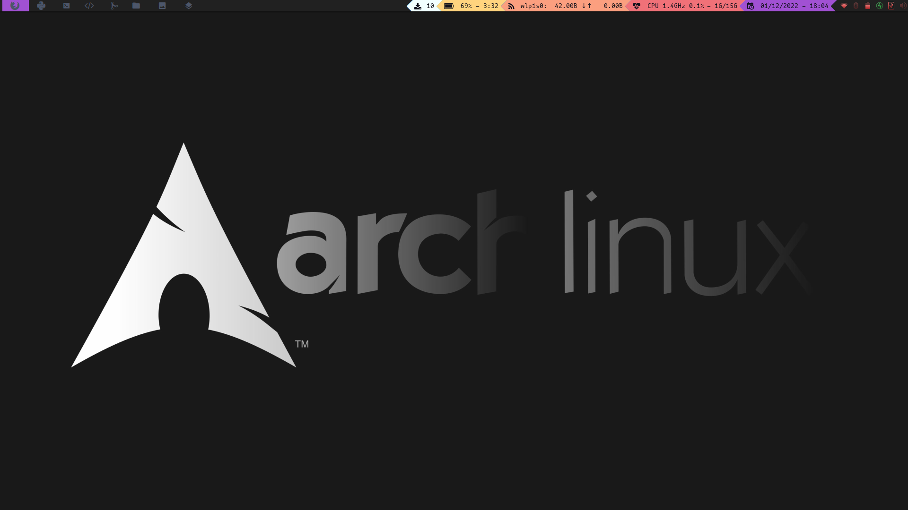

# Configuración de Arch Linux con Qtile

[](./README.md)
[](./LICENSE)

Este repositorio contiene mi configuración personalizada de **Arch Linux** utilizando el gestor de ventanas **Qtile**. Incluye configuraciones para terminal, entorno gráfico y otras herramientas esenciales.

## Contenido del Repositorio

- **`.bashrc`**: Archivo de configuración para la terminal con alias, funciones y personalizaciones útiles.
- **`.xprofile`**: Configuración de inicio de sesión para configurar variables de entorno y ejecutar procesos al inicio.
- **Carpeta `.config`**:
  - **`qtile/`**: Configuración completa de Qtile con atajos de teclado, widgets y temas.
  - **`alacritty/`**: Configuración personalizada para Alacritty, mi emulador de terminal preferido.
- **Imagen de ejemplo**: Una captura de pantalla mostrando cómo se ve mi configuración.

## Características

- **Gestor de ventanas: Qtile**
  - Atajos de teclado optimizados para productividad.
  - Widgets personalizados para mostrar información del sistema (CPU, RAM, Wi-Fi, etc.).
  - Temas visuales minimalistas y personalizables.

- **Terminal: Alacritty**
  - Configuración ligera y rápida con colores personalizados.
  - Soporte para fuentes con iconos (Nerd Fonts).

- **Arch Linux**:
  - Configuración adaptada para rendimiento y simplicidad.
  - Scripts personalizados para facilitar tareas comunes.

## Requisitos

1. **Arch Linux**: Instalado y configurado en tu sistema.
2. **Qtile**: Instalado con soporte para Python 3.
   - Puedes instalarlo con:
     ```bash
     sudo pacman -S qtile
     ```
3. **Alacritty**: Instalado como emulador de terminal.
   - Instálalo con:
     ```bash
     sudo pacman -S alacritty
     ```
4. **Nerd Fonts**: Para iconos y temas visuales (opcional).

## Instalación

1. Clona este repositorio:
   ```bash
   git clone https://github.com/mier48/arch-qtile-config.git
   cd arch-qtile-config
   ```

2. Copia los archivos a sus respectivas ubicaciones:
   ```bash
   cp .bashrc ~/
   cp .xprofile ~/
   cp -r .config/qtile ~/.config/
   cp -r .config/alacritty ~/.config/
   ```

3. Asegúrate de tener configurado tu `.xprofile` para ejecutar Qtile al inicio. Si usas un gestor de inicio como `lightdm`, edita:
   ```bash
   echo "exec qtile" > ~/.xinitrc
   ```

4. Reinicia tu sistema o cierra sesión y selecciona **Qtile** como gestor de ventanas.

## Uso

1. **Inicia sesión** en Qtile.
2. Usa los atajos de teclado predefinidos para navegar y gestionar ventanas. Algunos ejemplos:
   - `MOD + Enter`: Abrir la terminal (Alacritty).
   - `MOD + j/k`: Navegar entre ventanas.
   - `MOD + r`: Abrir el lanzador de aplicaciones (requiere `rofi` o similar).
   - `MOD + q`: Cerrar la ventana activa.

### Ejemplo Visual



## Personalización

- **Qtile**: Edita el archivo de configuración en `~/.config/qtile/config.py` para cambiar atajos de teclado, widgets o temas.
- **Alacritty**: Ajusta los colores, fuentes y comportamiento en `~/.config/alacritty/alacritty.yml`.
- **.bashrc**: Agrega o modifica alias y funciones según tus necesidades.

## Contribuciones

Si tienes sugerencias o mejoras para esta configuración, siéntete libre de abrir un _issue_ o enviar un _pull request_.

## Licencia

Este proyecto está licenciado bajo la [Licencia MIT](./LICENSE).

---
